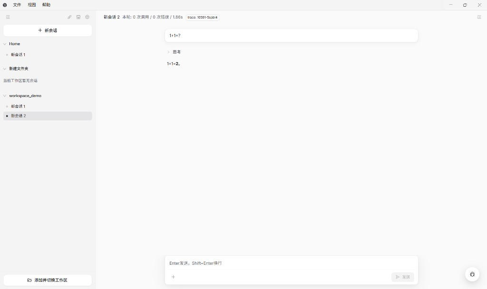

# Agenxy

[简体中文说明](README.zh-CN.md)

**Agenxy** is an AI agent suite in a **pnpm + Turborepo** monorepo: an **Electron** desktop client, a **Next.js** marketing site, and an optional **local Langfuse** stack for observability.

## Preview



## Highlights (desktop)

- Workspace-oriented layout: file tree, editor, and chat
- **MCP (Model Context Protocol)** server management and runtime integration
- Skills hub and skills marketplace
- Main-process capabilities such as terminal and filesystem tools
- Installers: **Windows (NSIS)**, **macOS (DMG)**, **Linux (AppImage)** — output under `apps/desktop/release/`

## Repository layout

The workspace is defined in `pnpm-workspace.yaml` (`apps/*`, `packages/*`, `services/*`). Current first-party packages live under `apps/` and `services/`.

```
agenxy/
├── apps/
│   ├── desktop/              # Electron app (electron-vite, React, Ant Design)
│   └── landing/              # Next.js landing page
├── services/
│   └── langfuse-local/       # Docker Compose Langfuse stack
├── assets/                   # Shared images (e.g. screenshots)
├── package.json              # Root scripts (Turbo orchestration)
└── turbo.json
```

Desktop source layout:

| Path | Role |
| --- | --- |
| `apps/desktop/src/main/` | Electron main process: agents, MCP, tools, storage |
| `apps/desktop/src/renderer/` | React UI |
| `apps/desktop/src/preload/` | Preload and IPC bridge |
| `apps/desktop/src/shared/` | Shared types and logic across processes |

## Prerequisites

- [Node.js](https://nodejs.org/) **18+**
- [pnpm](https://pnpm.io/) **9** (see `packageManager` in root `package.json`)
- [Docker](https://www.docker.com/) — only if you run **local Langfuse** (`services/langfuse-local`)

## Install

```bash
pnpm install
```

## Development

### Desktop app

```bash
pnpm desktop:dev
```

Debug build (inspect / remote debugging ports):

```bash
pnpm --filter @agenxy/desktop run dev:debug
```

### Landing page

```bash
pnpm landing:dev
```

### Run everything in dev mode

```bash
pnpm dev
```

(Turbo runs all `dev` tasks in parallel.)

## Local Langfuse (optional)

1. Copy `services/langfuse-local/.env.example` to `services/langfuse-local/.env.local` and adjust values.
2. From the repo root: `pnpm langfuse:start` (and `pnpm langfuse:stop`, `status`, `logs`, `reset` as needed).

See [services/langfuse-local/README.md](services/langfuse-local/README.md) for ports and details.

To send traces from the **desktop app** to that stack, copy `apps/desktop/.env.example` to `apps/desktop/.env.local` and set `LANGFUSE_BASE_URL`, `LANGFUSE_PUBLIC_KEY`, and `LANGFUSE_SECRET_KEY`, then restart the app.

## Common scripts (root)

| Command | Description |
| --- | --- |
| `pnpm dev` | Dev servers for all packages that define `dev` |
| `pnpm build` | Production build via Turbo |
| `pnpm lint` | ESLint across the workspace |
| `pnpm typecheck` | TypeScript checks across the workspace |
| `pnpm format` / `pnpm format:check` | Prettier (all); or `pnpm format:desktop` / `pnpm format:landing` for a single app |

### Desktop-only (from root)

| Command | Description |
| --- | --- |
| `pnpm desktop:build` | `electron-vite build` + `electron-builder` |
| `pnpm desktop:build:app` | Build only (no installer) |
| `pnpm desktop:preview` | Preview the built renderer bundle |

## Contributing

See [AGENTS.md](AGENTS.md) for maintainer and AI-assistant conventions (including English commit messages and PR metadata).

## License

[MIT](LICENSE)
