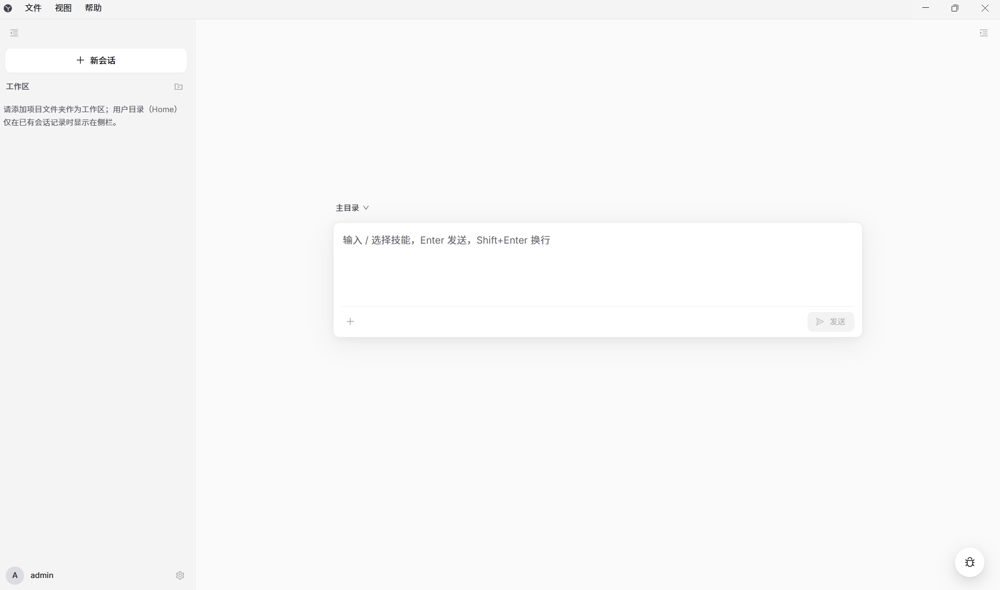

# OpenWorker

OpenWorker is a AI companion for everyday information processing, helping people make better choices.

## Preview



## Prerequisites

- [Node.js](https://nodejs.org/) **18+**
- [pnpm](https://pnpm.io/) **9**
- [Docker](https://www.docker.com/)

## Install

```bash
pnpm install
```

## Development

### Run core apps in dev mode

```bash
pnpm dev
```

Starts packages that define `dev`, except `@openworker/phone`, `@openworker/admin`, `@openworker/landing`, and `@openworker/cli`. For the full set:

```bash
pnpm dev:all
```

## Contributing

See [AGENTS.md](AGENTS.md) for maintainer and AI-assistant conventions (including English commit messages and PR metadata).

## License

[MIT](LICENSE)
